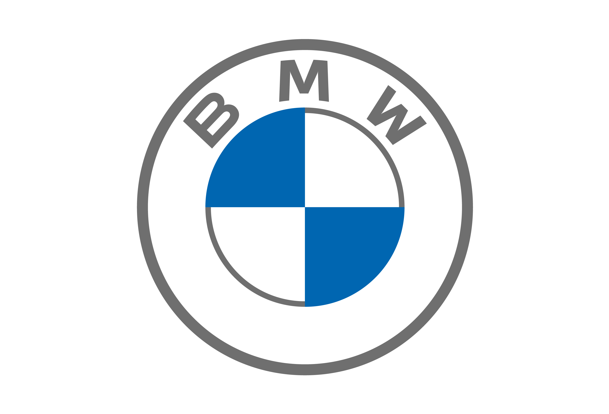
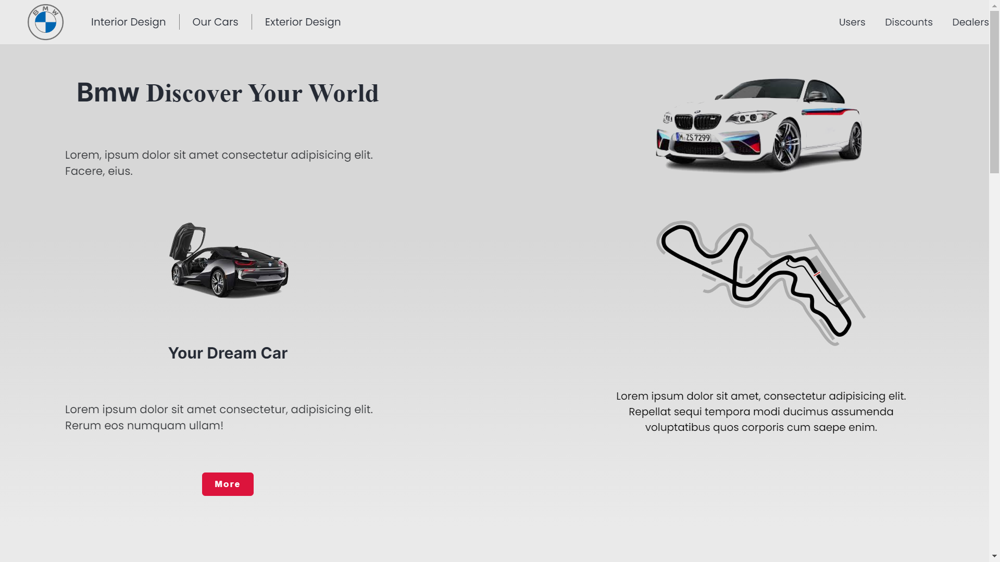
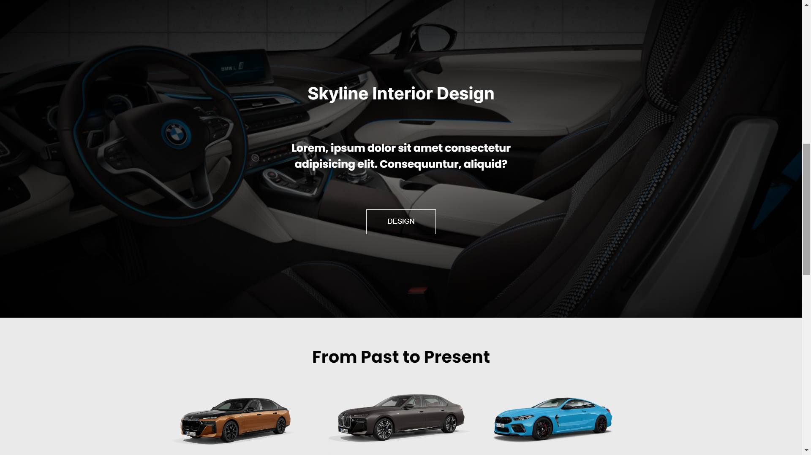
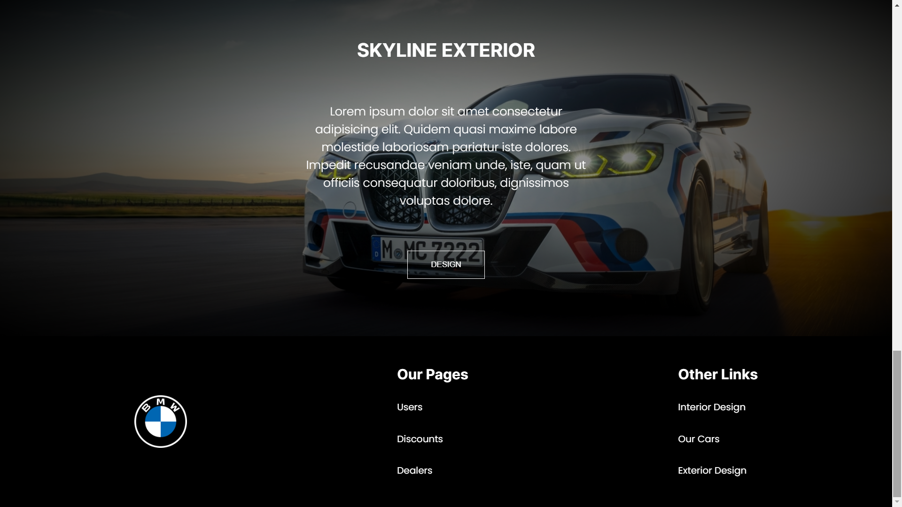
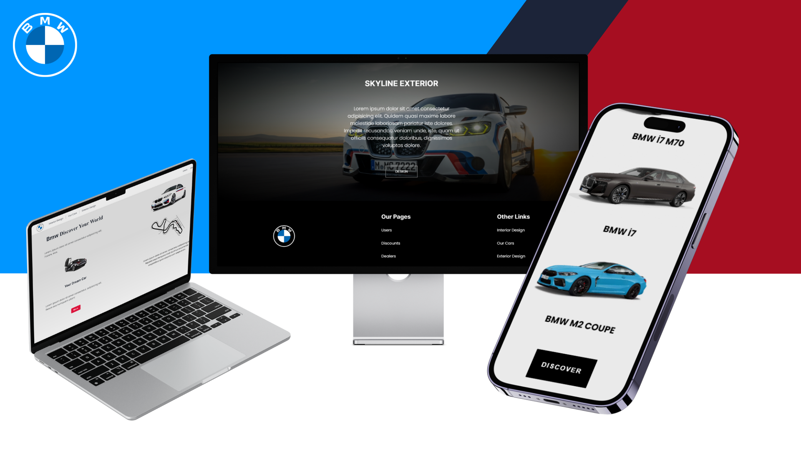
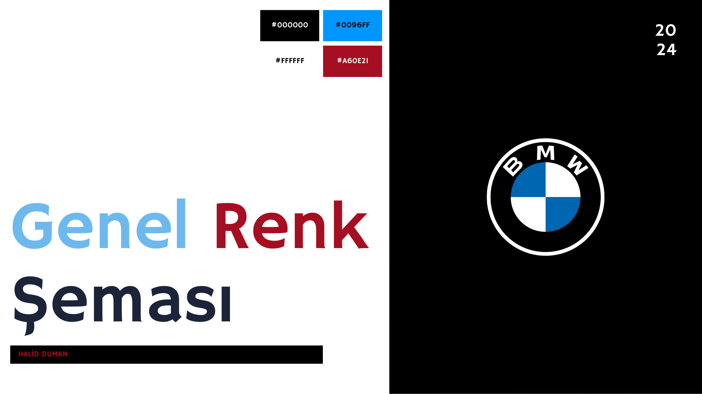

# BMW-web-site

**Başlık:** BMW

**Açıklama:** Bu web sitesi, frontend dersi için hazırlanmış bir proje ödevinden oluşmaktadır.

Tek sayfadan oluşan bu web sitesi, kırmızı ve mavi renkleri kullanılarak tasarlanmıştır. Bu renk paleti, dinamik ve çarpıcı bir atmosfer oluşturmayı amaçlamaktadır.

**Logo:**

**Genel Görsel:**

**Temel Bilgiler:**

* **Tasarım:** Sitemiz responsive bir tasarıma sahip ve tek sayfadan oluşuyor.
* **Renk Paleti:** kırmızı , mavi , beyaz ve siyah renkleri kullanılarak tasarlanmıştır.
* **Kullanılan Teknolojiler:**
    * HTML
    * CSS
    * SCSS

**Sayfalar:**

## Ana Sayfa

## Hakkımızda

## Kurslar

* **Kullanılan Teknolojiler:**
    * HTML
    * CSS
    * JavaScript

**Ek Özellikler:**

# Responsive
 

# Renkler

 

